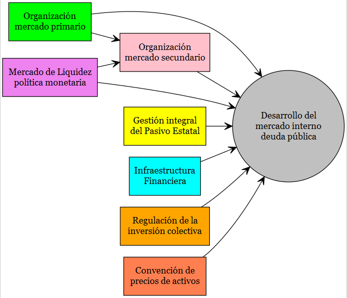
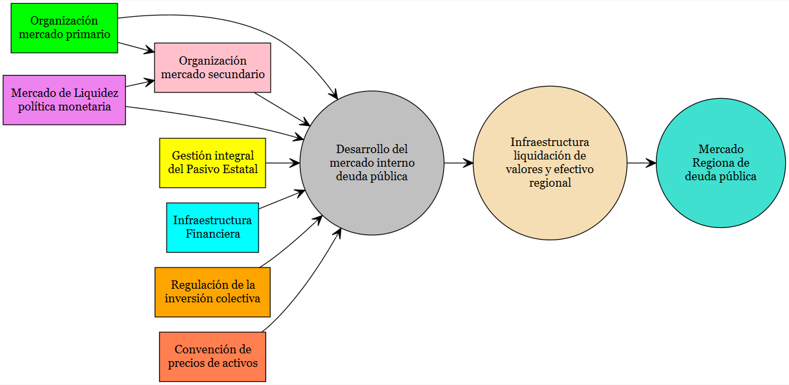
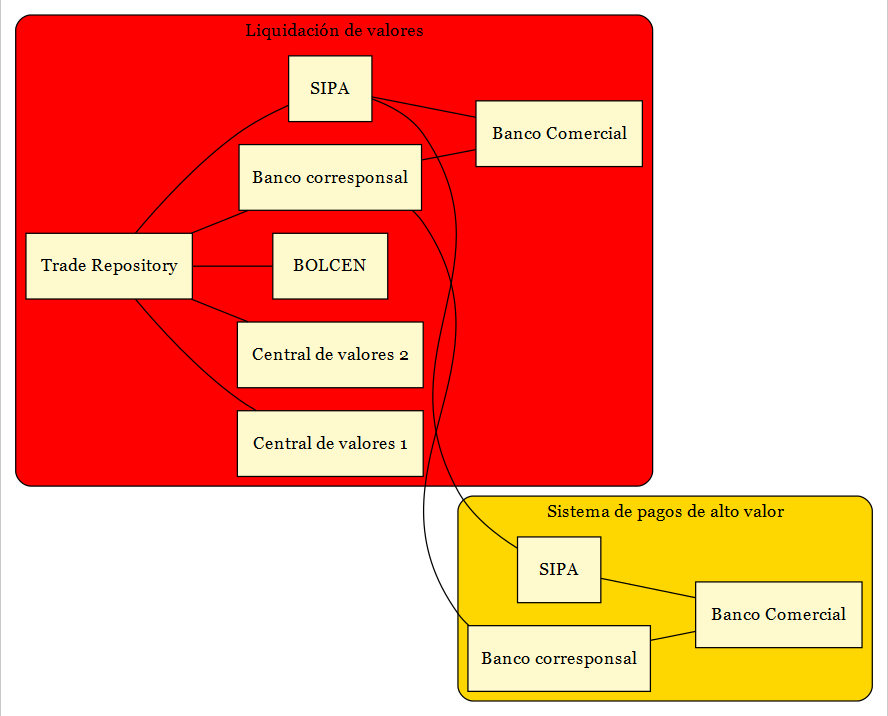

layout: true
background-image: url(Logo.jpg)
background-position: 95% 2.5% 
background-size: 10%
---

**ÍNDICE**   
1. [LOS ESTÁNDARES](#id1)

2. [AVANCES POR ÁREAS DE ACCIÓN](#id2)

3. [DESAFÍOS](#id3)

4. [VISIÓN DEL MERCADO DE DEUDA PÚBLICA (Warehouse approach)](#id4)


---
### LOS ESTÁNDARES <a name="id1"></a>

$$ $$

- **Los Estándares** son un conjunto de reglas mínimas, aprobadas y establecidas en el 2003 por los países de la región (Centroamérica, Panamá y República Dominicana), con la finalidad de armonizar los instrumentos de deuda pública entre estos países.

- **Los Estándares** desde su aprobación, han orientado *la organización de los mercados internos de deuda pública*, sirviendo de base para el desarrollo del Mercado de Deuda Pública Regional.

---
### ESTÁNDARES POR ÁREAS DE ACCIÓN

$$ $$

```{r include=FALSE, cache=FALSE, results = 'hide', message = FALSE}
library(DiagrammeR) 
library(DiagrammeRsvg) 
library(rsvg) 

G <-grViz("digraph{

      graph[rankdir = LR]
  
      node[shape = rectangle, style = filled]
  
      node[fillcolor = green, margin = 0.2]
      A[label = 'Organización \n mercado primario']
      
      node[fillcolor = pink, margin = 0.2]
      B[label = 'Organización \n mercado secundario']
  
      node[fillcolor = Violet, margin = 0.2]
      C[label = 'Mercado de Liquidez \n política monetaria']
      
      node[fillcolor = yellow, margin = 0.2]
      D[label = 'Gestión integral \n del Pasivo Estatal']
      
      node[fillcolor = cyan, margin = 0.2]
      E[label = 'Infraestructura \n Financiera']
      
      node[fillcolor = orange, margin = 0.2]
      F[label = 'Regulación de la \n inversión colectiva']
      
      node[fillcolor = coral, margin = 0.2]
      G[label = 'Convención de \n precios de activos']
      
      node[shape = circle, fillcolor =gray, margin = 0.2]
      META[label = 'Desarrollo del \n mercado interno \n deuda pública']
      
      edge[color = black, arrowhead = vee, arrowsize = 1.25]
      A -> B
      C -> B
      A -> META
      B -> META
      C -> META
      D -> META
      E -> META
      F -> META
      G -> META
      
     }")
# export graph
export_svg(G) %>%
  charToRaw() %>%
  rsvg() %>%
  png::writePNG("G1.png")
```
```{r echo=FALSE, out.width = "750px", out.height="450px",fig.align='center'}
#
```
```{r echo=FALSE, warning=FALSE, results='asis'}
G
```
---
### AVANCES POR ÁREAS DE ACCIÓN (Diagnóstico SECMCA (2017)) <a name="id2"></a>

```{r include=FALSE, cache=FALSE, results = 'hide', message = FALSE}
library(kableExtra)
library(latex2exp)
library(dplyr)
A<-c("CO","CR","DO", "GT", "HN", "NI", "PA", "SV")
B<-c("CO","CR","DO", "GT", "HN", "NI", "PA", "SV")
C<-c("CO","CR","DO*", "GT", "HN", "NI", "PA", "SV*")
D<-c("CO*","CR*","DO*", "GT*", "HN*", "NI*", "PA*", "SV*")
E<-c("CO","CR","DO", "GT", "HN", "NI", "PA", "SV")
G<-c("CO","CR","DO", "GT", "HN*", "NI", "PA", "SV")
H<-c("CO","CR","DO*", "GT*", "HN*", "NI*", "PA", "SV*")
df<-rbind(A,B,C,D,E,G,H)
df<-as.data.frame(df)
row.names(df) <- NULL
colnames(df)<-c("CO","CR","DO", "GT", "HN", "NI", "PA", "SV")
df$CR = cell_spec(df$CR, background = ifelse(df$CR=="CR*", "red", "yellowgreen"))
df$GT = cell_spec(df$GT, background = ifelse(df$GT=="GT*", "red", "yellowgreen"))
df$HN = cell_spec(df$HN, background = ifelse(df$HN=="HN*", "red", "yellowgreen"))
df$NI = cell_spec(df$NI, background = ifelse(df$NI=="NI*", "red", "yellowgreen"))
df$PA = cell_spec(df$PA, background = ifelse(df$PA=="PA*", "red", "yellowgreen"))
df$SV = cell_spec(df$SV, background = ifelse(df$SV=="SV*", "red", "yellowgreen"))
df$DO = cell_spec(df$DO, background = ifelse(df$DO=="DO*", "red", "yellowgreen"))
df<- df[c("CO","CR","DO", "GT", "HN", "NI", "PA", "SV")]
```

```{r echo=FALSE, warning=FALSE, results='asis'}
 kbl(df, escape = F, caption = "ORGANIZACIÓN DEL MERCADO PRIMARIO") %>%
   kable_styling(bootstrap_options = "striped", full_width = F, position = "center",  font_size = 20)%>%
  kable_classic(full_width = F, html_font = "Cambria")%>%
  row_spec(0, bold = T, color = "white",   background = "white")%>%
  pack_rows("1. Liderazgo del Gobierno", 1, 1, label_row_css = "background-color: green; color: #fff;") %>%
  row_spec(1, bold = T, color = "white",   background = "yellowgreen")%>%
  pack_rows("2. Funciona comité de coordinación interinstitucional", 2, 2, label_row_css = "background-color: green; color: #fff;") %>%
  row_spec(2, bold = T, color = "white",   background = "yellowgreen")%>%
  pack_rows("3. Se tiene plan de acción diseñado en base a los estándares", 3, 3, label_row_css = "background-color: green; color: #fff;") %>%
  row_spec(3, bold = T, color = "white",   background = "yellowgreen")%>%
  pack_rows("4. Enlace del sector pública y el sector privado", 4, 4, label_row_css = "background-color: green; color: #fff;") %>%
  row_spec(4, bold = T, color = "white",   background = "yellowgreen")%>%
  pack_rows("5. Funciona regularmente una subasta competitiva", 5, 5, label_row_css = "background-color: green; color: #fff;") %>%
  row_spec(5, bold = T, color = "white",   background = "yellowgreen")%>%
  pack_rows("6. Funciona subasta no competitiva sólo después de la competitiva", 6, 6, label_row_css = "background-color: green; color: #fff;") %>%
  row_spec(6, bold = T, color = "white",   background = "yellowgreen")%>%
  pack_rows("7. Subasta con los mismos participantes, independiente del emisor", 7, 7, label_row_css = "background-color: green; color: #fff;") %>%
  row_spec(7, bold = T, color = "white",   background = "yellowgreen")%>%
  column_spec(1, color = "white", background = "white")
```

---
### AVANCES POR ÁREAS DE ACCIÓN (Diagnóstico SECMCA (2017)) 

```{r include=FALSE, cache=FALSE, results = 'hide', message = FALSE}
library(kableExtra)
library(latex2exp)
library(dplyr)
A<-c("CO","CR","DO", "GT", "HN", "NI", "PA", "SV")
B<-c("CO","CR","DO", "GT", "HN*", "NI*", "PA", "SV*")
C<-c("CO","CR","DO", "GT", "HN", "NI", "PA", "SV")
D<-c("CO","CR","DO", "GT*", "HN", "NI", "PA", "SV")
E<-c("CO","CR","DO", "GT", "HN", "NI", "PA", "SV")
G<-c("CO","CR","DO", "GT", "HN", "NI", "PA", "SV")
H<-c("CO","CR","DO", "GT", "HN", "NI", "PA", "SV")
df<-rbind(A,B,C,D,E,G,H)
df<-as.data.frame(df)
row.names(df) <- NULL
colnames(df)<-c("CO","CR","DO", "GT", "HN", "NI", "PA", "SV")
df$CR = cell_spec(df$CR, background = ifelse(df$CR=="CR*", "red", "yellowgreen"))
df$GT = cell_spec(df$GT, background = ifelse(df$GT=="GT*", "red", "yellowgreen"))
df$HN = cell_spec(df$HN, background = ifelse(df$HN=="HN*", "red", "yellowgreen"))
df$NI = cell_spec(df$NI, background = ifelse(df$NI=="NI*", "red", "yellowgreen"))
df$PA = cell_spec(df$PA, background = ifelse(df$PA=="PA*", "red", "yellowgreen"))
df$SV = cell_spec(df$SV, background = ifelse(df$SV=="SV*", "red", "yellowgreen"))
df$DO = cell_spec(df$DO, background = ifelse(df$DO=="DO*", "red", "yellowgreen"))
df<- df[c("CO","CR","DO", "GT", "HN", "NI", "PA", "SV")]
```

```{r echo=FALSE, warning=FALSE, results='asis'}
 kbl(df, escape = F, caption = "ORGANIZACIÓN DEL MERCADO PRIMARIO") %>%
   kable_styling(bootstrap_options = "striped", full_width = F, position = "center",  font_size = 20)%>%
  kable_classic(full_width = F, html_font = "Cambria")%>%
  row_spec(0, bold = T, color = "white",   background = "white")%>%
  pack_rows("8. Se establece día fijo y un calendario de emisión", 1, 1, label_row_css = "background-color: green; color: #fff;") %>%
  row_spec(1, bold = T, color = "white",   background = "yellowgreen")%>%
   pack_rows("9. Se pública el monto global de emisión por cada plazo", 2, 2, label_row_css = "background-color: green; color: #fff;") %>%
  row_spec(2, bold = T, color = "white",   background = "yellowgreen")%>%
   pack_rows("10. Acceso abierto a participar", 3, 3, label_row_css = "background-color: green; color: #fff;") %>%
  row_spec(3, bold = T, color = "white",   background = "yellowgreen")%>%
  pack_rows("11. Nuevas colocaciones de emisores soberanos siguen los estándares", 4, 4, label_row_css = "background-color: green; color: #fff;") %>%
  row_spec(4, bold = T, color = "white",   background = "yellowgreen")%>%
  pack_rows("12. Se ejecuta plan de canje de deuda no estandarizada", 5, 5, label_row_css = "background-color: gray; color: #fff;") %>%
  row_spec(5, bold = T, color = "white",   background = "gray")%>%
  pack_rows("13. Se hacen colocaciones por tramos en magnitudes relevantes", 6, 6, label_row_css = "background-color: gray; color: #fff;") %>%
  row_spec(6, bold = T, color = "white",   background = "gray")%>%
  pack_rows("14. Colocaciones a corto plazo menores a 12 meses", 7, 7, label_row_css = "background-color: green; color: #fff;") %>%
  row_spec(7, bold = T, color = "white",   background = "yellowgreen")%>%
  column_spec(1, color = "white", background = "white") 
```

---
### AVANCES POR ÁREAS DE ACCIÓN (Diagnóstico SECMCA (2017)) 

```{r include=FALSE, cache=FALSE, results = 'hide', message = FALSE}
library(kableExtra)
library(latex2exp)
library(dplyr)
I<-c("CO","CR","DO", "GT", "HN", "NI", "PA", "SV")
J<-c("CO","CR","DO", "GT", "HN", "NI", "PA", "SV")
K<-c("CO","CR","DO", "GT", "HN*", "NI", "PA", "SV*")
df<-rbind(I,J,K)
df<-as.data.frame(df)
row.names(df) <- NULL
colnames(df)<-c("CO","CR","DO", "GT", "HN", "NI", "PA", "SV")
df$CR = cell_spec(df$CR, background = ifelse(df$CR=="CR*", "red", "yellowgreen"))
df$GT = cell_spec(df$GT, background = ifelse(df$GT=="GT*", "red", "yellowgreen"))
df$HN = cell_spec(df$HN, background = ifelse(df$HN=="HN*", "red", "yellowgreen"))
df$NI = cell_spec(df$NI, background = ifelse(df$NI=="NI*", "red", "yellowgreen"))
df$PA = cell_spec(df$PA, background = ifelse(df$PA=="PA*", "red", "yellowgreen"))
df$SV = cell_spec(df$SV, background = ifelse(df$SV=="SV*", "red", "yellowgreen"))
df$DO = cell_spec(df$DO, background = ifelse(df$DO=="DO*", "red", "yellowgreen"))
df<- df[c("CO","CR","DO", "GT", "HN", "NI", "PA", "SV")]
```

```{r echo=FALSE, warning=FALSE, results='asis'}
 kbl(df, escape = F, caption = "ORGANIZACIÓN DEL MERCADO PRIMARIO") %>%
   kable_styling(bootstrap_options = "striped", full_width = F, position = "center",  font_size = 20)%>%
  kable_classic(full_width = F, html_font = "Cambria")%>%
  row_spec(0, bold = T, color = "white",   background = "white")%>%
  pack_rows("15. Se emite a 3 años hasta US$300 millones", 1, 1, label_row_css = "background-color: gray; color: #fff;") %>%
  row_spec(1, bold = T, color = "white",   background = "gray")%>%
  pack_rows("16. Se emite a 5 años hasta US$300 millones", 2, 2, label_row_css = "background-color: gray; color: #fff;") %>%
  row_spec(2, bold = T, color = "white",   background = "gray")%>%
   pack_rows("17. Se monitorea un benchmark por plazos", 3, 3, label_row_css = "background-color: green; color: #fff;") %>%
  row_spec(3, bold = T, color = "white",   background = "yellowgreen")%>%
  column_spec(1, color = "white", background = "white") 
```

---
### AVANCES POR ÁREAS DE ACCIÓN (Diagnóstico SECMCA (2017)) 

```{r include=FALSE, cache=FALSE, results = 'hide', message = FALSE}
library(kableExtra)
library(latex2exp)
library(dplyr)
A<-c("CO","CR","DO", "GT", "HN", "NI", "PA", "SV")
B<-c("CO","CR","DO", "GT", "HN", "NI", "PA", "SV")
C<-c("CO","CR","DO", "GT", "HN", "NI", "PA", "SV")
df<-rbind(A,B,C)
df<-as.data.frame(df)
row.names(df) <- NULL
colnames(df)<-c("CO","CR","DO", "GT", "HN", "NI", "PA", "SV")
df$CR = cell_spec(df$CR, background = ifelse(df$CR=="CR*", "red", "yellowgreen"))
df$GT = cell_spec(df$GT, background = ifelse(df$GT=="GT*", "red", "yellowgreen"))
df$HN = cell_spec(df$HN, background = ifelse(df$HN=="HN*", "red", "yellowgreen"))
df$NI = cell_spec(df$NI, background = ifelse(df$NI=="NI*", "red", "yellowgreen"))
df$PA = cell_spec(df$PA, background = ifelse(df$PA=="PA*", "red", "yellowgreen"))
df$SV = cell_spec(df$SV, background = ifelse(df$SV=="SV*", "red", "yellowgreen"))
df$DO = cell_spec(df$DO, background = ifelse(df$DO=="DO*", "red", "yellowgreen"))
df<- df[c("CO","CR","DO", "GT", "HN", "NI", "PA", "SV")]
```

```{r echo=FALSE, warning=FALSE, results='asis'}
 kbl(df, escape = F, caption = "GESTIÓN INTEGRAL DE PASIVO ESTATAL") %>%
   kable_styling(bootstrap_options = "striped", full_width = F, position = "center",  font_size = 20)%>%
  kable_classic(full_width = F, html_font = "Cambria")%>%
  row_spec(0, bold = T, color = "white",   background = "white")%>%
  pack_rows("18. Funciona organización institucional basada en un comité", 1, 1, label_row_css = "background-color: green; color: #fff;") %>%
  row_spec(1, bold = T, color = "white",   background = "yellowgreen")%>%
  pack_rows("19. Mecanismo permanente de coordinación entre Gobierno y Banco Central", 2, 2, label_row_css = "background-color: green; color: #fff;") %>%
  row_spec(2, bold = T, color = "white",   background = "yellowgreen")%>%
   pack_rows("20. Sustitución de deuda externa bonificada por deuda interna estandarizada", 3, 3, label_row_css = "background-color: gray; color: #fff;") %>%
  row_spec(3, bold = T, color = "white",   background = "gray")%>%
  column_spec(1, color = "white", background = "white") 
```


```{r include=FALSE, cache=FALSE, results = 'hide', message = FALSE}
library(kableExtra)
library(latex2exp)
library(dplyr)
A<-c("CO","CR","DO", "GT", "HN", "NI*", "PA", "SV")
B<-c("CO","CR*","DO*", "GT", "HN", "NI", "PA", "SV")
df<-rbind(A,B)
df<-as.data.frame(df)
row.names(df) <- NULL
colnames(df)<-c("CO","CR","DO", "GT", "HN", "NI", "PA", "SV")
df$CR = cell_spec(df$CR, background = ifelse(df$CR=="CR*", "red", "yellowgreen"))
df$GT = cell_spec(df$GT, background = ifelse(df$GT=="GT*", "red", "yellowgreen"))
df$HN = cell_spec(df$HN, background = ifelse(df$HN=="HN*", "red", "yellowgreen"))
df$NI = cell_spec(df$NI, background = ifelse(df$NI=="NI*", "red", "yellowgreen"))
df$PA = cell_spec(df$PA, background = ifelse(df$PA=="PA*", "red", "yellowgreen"))
df$SV = cell_spec(df$SV, background = ifelse(df$SV=="SV*", "red", "yellowgreen"))
df$DO = cell_spec(df$DO, background = ifelse(df$DO=="DO*", "red", "yellowgreen"))
df<- df[c("CO","CR","DO", "GT", "HN", "NI", "PA", "SV")]

```{r echo=FALSE, warning=FALSE, results='asis'}
 kbl(df, escape = F, caption = "MERCADO DE LIQUIDEZ Y POLÍTICA MONETARIA") %>%
   kable_styling(bootstrap_options = "striped", full_width = F, position = "center",  font_size = 20)%>%
  kable_classic(full_width = F, html_font = "Cambria")%>%
  row_spec(0, bold = T, color = "white",   background = "white")%>%
  pack_rows("21. Registro y difusión diaria de operaciones interbancarias", 1, 1, label_row_css = "background-color: green; color: #fff;") %>%
  row_spec(1, bold = T, color = "white",   background = "yellowgreen")%>%
  pack_rows("22. Separación de emisiones para financiar el déficit cuasifíscal", 2, 2, label_row_css = "background-color: green; color: #fff;") %>%
  row_spec(2, bold = T, color = "white",   background = "yellowgreen")%>%
  column_spec(1, color = "white", background = "white") 
```


---
### AVANCES POR ÁREAS DE ACCIÓN (Diagnóstico SECMCA (2017)) 

```{r include=FALSE, cache=FALSE, results = 'hide', message = FALSE}
library(kableExtra)
library(latex2exp)
library(dplyr)
A<-c("CO","CR","DO", "GT", "HN", "NI", "PA", "SV")
B<-c("CO","CR","DO", "GT", "HN", "NI", "PA", "SV")
df<-rbind(A,B)
df<-as.data.frame(df)
row.names(df) <- NULL
colnames(df)<-c("CO","CR","DO", "GT", "HN", "NI", "PA", "SV")
df$CR = cell_spec(df$CR, background = ifelse(df$CR=="CR*", "red", "yellowgreen"))
df$GT = cell_spec(df$GT, background = ifelse(df$GT=="GT*", "red", "yellowgreen"))
df$HN = cell_spec(df$HN, background = ifelse(df$HN=="HN*", "red", "yellowgreen"))
df$NI = cell_spec(df$NI, background = ifelse(df$NI=="NI*", "red", "yellowgreen"))
df$PA = cell_spec(df$PA, background = ifelse(df$PA=="PA*", "red", "yellowgreen"))
df$SV = cell_spec(df$SV, background = ifelse(df$SV=="SV*", "red", "yellowgreen"))
df$DO = cell_spec(df$DO, background = ifelse(df$DO=="DO*", "red", "yellowgreen"))
df<- df[c("CO","CR","DO", "GT", "HN", "NI", "PA", "SV")]
```

```{r echo=FALSE, warning=FALSE, results='asis'}
 kbl(df, escape = F, caption = "INFRAESTRUCTURA FINANCIERA") %>%
   kable_styling(bootstrap_options = "striped", full_width = F, position = "center",  font_size = 20)%>%
  kable_classic(full_width = F, html_font = "Cambria")%>%
  row_spec(0, bold = T, color = "white",   background = "white")%>%
  pack_rows("23. Desarrollo de sistemas de compensación y liquidación de valores según estándares", 1, 1, label_row_css = "background-color: green; color: #fff;") %>%
  row_spec(1, bold = T, color = "white",   background = "yellowgreen")%>%
  pack_rows("24. Desarrollo de sistemas de pagos según estándares", 2, 2, label_row_css = "background-color: green; color: #fff;") %>%
  row_spec(2, bold = T, color = "white",   background = "yellowgreen")%>%
  column_spec(1, color = "white", background = "white") 
```


```{r include=FALSE, cache=FALSE, results = 'hide', message = FALSE}
library(kableExtra)
library(latex2exp)
library(dplyr)
A<-c("CO","CR","DO", "GT*", "HN", "NI", "PA", "SV")
df<-rbind(A)
df<-as.data.frame(df)
row.names(df) <- NULL
colnames(df)<-c("CO","CR","DO", "GT", "HN", "NI", "PA", "SV")
df$CR = cell_spec(df$CR, background = ifelse(df$CR=="CR*", "red", "yellowgreen"))
df$GT = cell_spec(df$GT, background = ifelse(df$GT=="GT*", "red", "yellowgreen"))
df$HN = cell_spec(df$HN, background = ifelse(df$HN=="HN*", "red", "yellowgreen"))
df$NI = cell_spec(df$NI, background = ifelse(df$NI=="NI*", "red", "yellowgreen"))
df$PA = cell_spec(df$PA, background = ifelse(df$PA=="PA*", "red", "yellowgreen"))
df$SV = cell_spec(df$SV, background = ifelse(df$SV=="SV*", "red", "yellowgreen"))
df$DO = cell_spec(df$DO, background = ifelse(df$DO=="DO*", "red", "yellowgreen"))
df<- df[c("CO","CR","DO", "GT", "HN", "NI", "PA", "SV")]
```

```{r echo=FALSE, warning=FALSE, results='asis'}
 kbl(df, escape = F, caption = "REGULACIÓN DE LA INVERSIÓN COLECTIVA") %>%
   kable_styling(bootstrap_options = "striped", full_width = F, position = "center",  font_size = 20)%>%
  kable_classic(full_width = F, html_font = "Cambria")%>%
  row_spec(0, bold = T, color = "white",   background = "white")%>%
  pack_rows("25. Normativa de los fondos de inversión conforme a estándares", 1, 1, label_row_css = "background-color: green; color: #fff;") %>%
  row_spec(1, bold = T, color = "white",   background = "yellowgreen")%>%
  column_spec(1, color = "white", background = "white") 
```


```{r include=FALSE, cache=FALSE, results = 'hide', message = FALSE}
library(kableExtra)
library(latex2exp)
library(dplyr)
A<-c("CO","CR","DO", "GT", "HN", "NI", "PA", "SV")
B<-c("CO","CR*","DO", "GT", "HN", "NI*", "PA", "SV*")
df<-rbind(A,B)
df<-as.data.frame(df)
row.names(df) <- NULL
colnames(df)<-c("CO","CR","DO", "GT", "HN", "NI", "PA", "SV")
df$CR = cell_spec(df$CR, background = ifelse(df$CR=="CR*", "red", "yellowgreen"))
df$GT = cell_spec(df$GT, background = ifelse(df$GT=="GT*", "red", "yellowgreen"))
df$HN = cell_spec(df$HN, background = ifelse(df$HN=="HN*", "red", "yellowgreen"))
df$NI = cell_spec(df$NI, background = ifelse(df$NI=="NI*", "red", "yellowgreen"))
df$PA = cell_spec(df$PA, background = ifelse(df$PA=="PA*", "red", "yellowgreen"))
df$SV = cell_spec(df$SV, background = ifelse(df$SV=="SV*", "red", "yellowgreen"))
df$DO = cell_spec(df$DO, background = ifelse(df$DO=="DO*", "red", "yellowgreen"))
df<- df[c("CO","CR","DO", "GT", "HN", "NI", "PA", "SV")]
```

```{r echo=FALSE, warning=FALSE, results='asis'}
 kbl(df, escape = F, caption = "CONVENCIONES DEL CALCULO DE LOS VALORES DE DEUDA PÚBLICA") %>%
   kable_styling(bootstrap_options = "striped", full_width = F, position = "center",  font_size = 20)%>%
  kable_classic(full_width = F, html_font = "Cambria")%>%
  row_spec(0, bold = T, color = "white",   background = "white")%>%
  pack_rows("26. La cotización y asignación de las subastas se hace por precios", 1, 1, label_row_css = "background-color: green; color: #fff;") %>%
  row_spec(1, bold = T, color = "white",   background = "yellowgreen")%>%
  pack_rows("27. La valoración se hace conforme con los estándares", 2, 2, label_row_css = "background-color: green; color: #fff;") %>%
  row_spec(2, bold = T, color = "white",   background = "yellowgreen")%>%
  column_spec(1, color = "white", background = "white") 
```


---
### DESAFÍOS <a name="id3"></a>

$$ $$

1. Revisar, anular o agregar los Estándares.

**Estándares sujetos a revisión**
- (4) Enlace del sector pública y el sector privado.
- (7) Subasta con los mismos participantes, independiente del emisor.
- (22) Separación de emisiones para financiar el déficit cuasifísca.
- (27) La valoración se hace conforme con los estándares: corto plazo (<1 año): actual/360 y largo plazo (>1 año) actual/actual.

**Estándares sujetos a anular**
- (12) Se ejecuta plan de canje de deuda no estandarizada.
- (13) Se hacen colocaciones por tramos en magnitudes relevantes.
- (15) Se emite a 3 años hasta US$300 millones.
- (16) Se emite a 5 años hasta US$300 millones.
- (20) Sustitución de deuda externa bonificada por deuda interna estandarizada.


---
### DESAFÍOS
$$ $$

1. Revisar, anular o agregar los Estándares.

**Estándares sujetos a agregar**

Disposición de una estrátegia de gestión de la deuda que contemple:
- Horizonte de mediano plazo.
- Basado en análisis de sostenibilidad de la deuda.
- Coordinación con otras políticas macroeconómicas.
- Sujetas a comparación regional.

---
### DESAFÍOS 

$$ $$
$2.$ Apuntalar la infraestructura del Mercado Financiero Regional e integrar Socios
Estratégicos.

```{r include=FALSE, cache=FALSE, results = 'hide', message = FALSE}
library(DiagrammeR) 
library(DiagrammeRsvg) 
library(rsvg) 

G <-grViz("digraph{

      graph[rankdir = LR]
  
      node[shape = rectangle, style = filled]
  
      node[fillcolor = green, margin = 0.2]
      A[label = 'Organización \n mercado primario']
      
      node[fillcolor = pink, margin = 0.2]
      B[label = 'Organización \n mercado secundario']
  
      node[fillcolor = Violet, margin = 0.2]
      C[label = 'Mercado de Liquidez \n política monetaria']
      
      node[fillcolor = yellow, margin = 0.2]
      D[label = 'Gestión integral \n del Pasivo Estatal']
      
      node[fillcolor = cyan, margin = 0.2]
      E[label = 'Infraestructura \n Financiera']
      
      node[fillcolor = orange, margin = 0.2]
      F[label = 'Regulación de la \n inversión colectiva']
      
      node[fillcolor = coral, margin = 0.2]
      G[label = 'Convención de \n precios de activos']
      
      node[shape = circle, fillcolor =gray, margin = 0.2]
      META[label = 'Desarrollo del \n mercado interno \n deuda pública']
      
      node[fillcolor = wheat, margin = 0.2]
      BCIE[label = 'Infraestructura \n liquidación de \n valores y efectivo \n regional']
      
      node[shape = circle, fillcolor =turquoise, margin = 0.2]
      META2[label = 'Mercado \n Regiona de \n deuda pública']
      
      edge[color = black, arrowhead = vee, arrowsize = 1.25]
      A -> B
      C -> B
      A -> META
      B -> META
      C -> META
      D -> META
      E -> META
      F -> META
      G -> META
      META -> BCIE
      BCIE -> META2
     }")
# export graph
export_svg(G) %>%
  charToRaw() %>%
  rsvg() %>%
  png::writePNG("G2.png")
```
```{r echo=FALSE, out.width = "750px", out.height="450px",fig.align='center'}

```

---
### DESAFÍOS 

$$ $$
2.A Propuesta de un "Trade Repository"


El COSEFIN emite solicitud formal al BCIE para integrarse al Comité Técnico de Estándares Regionales.

EL BCIE, comprende que para posibilitar un mercado de deuda soberana integrado, es necesario una infraestructura que haga efectiva la negociación, compensación, liquidación y custodia a nivel regional de valores.

Las Secretarías del CMCA y COSEFIN junto al BCIE, redactaron los Términos de Referencia para la contratación de una consultoría con los siguientes requerimientos:

- Diseñar una infraestructura normativa.
- Identificar esa infraestructura y las inversiones necesarias para ponerla en marcha.
- Proponer los elementos necesarios para su gobernanza y sostenibilidad.

---
### DESAFÍOS 

$$ $$
2.B Vincular el SIPA con el "Trade Repository"

La consolidación del Sistema de Interconexión de Pagos (SIPA) como una plataforma reconocida y usada ampliamente por el mercado financiero regional dependerá de afrontar los siguientes retos:

- Automatizar plenamente las transacciones
- Establecer en Panamá un LBTR en incluirlo en el SIPA
- Incorporar las Depositarias Centrales de Valores de los países de la Región como participantes del SIPA.
- Ver la factibilidad técnica y jurídica de vincularse con el "Trade Repository"

---
### DESAFÍOS 

$$ $$

$3.$ Mejorar los marcos para la gestión de riesgos soberano en los sistemas financieros de la región.

Los bancos, compañías de seguro y administradoras de pensiones, mantienen una demanda de títulos y valores de deuda soberana por las razones siguientes:

- Gestión de balances
- Atribuciones de creación de mercado
- **Legislación y regulación** (El Marco de capital ponderado por riesgo, El Marco del coeficiente de apalancamiento, El Marco de liquidez, etc.)
- Fragmentación
- Oportunidades de inversión


---
### VISIÓN DEL MERCADO DE DEUDA PÚBLICA (Warehouse approach) <a name="id4"></a>

$$ $$

```{r include=FALSE, cache=FALSE, results = 'hide', message = FALSE}
library(DiagrammeR) 
library(DiagrammeRsvg) 
library(rsvg) 

G <-grViz("digraph{

      graph[rankdir = LR]
  
      
      node[shape = rectangle, style = filled]
  
      subgraph cluster_0 {
        graph[shape = rectangle]
        style = rounded
        bgcolor = red
    
        label = 'Liquidación de valores'
        node[shape = rectangle, fillcolor = LemonChiffon, margin = 0.25]
        F[label = 'Central de valores 1']
        FF[label = 'Central de valores 2']
        G[label = 'Trade Repository']
        H[label = 'BOLCEN']
        I[label = 'Banco corresponsal']
        J[label = 'SIPA']
        K[label = 'Banco Comercial']
      }
  
      subgraph cluster_1 {
         graph[shape = rectangle]
         style = rounded
         bgcolor = Gold
    
         label = 'Sistema de pagos de alto valor'
         node[shape = rectangle, fillcolor = LemonChiffon, margin = 0.25]
         L[label = 'Banco corresponsal']
         M[label = 'SIPA']
         N[label = 'Banco Comercial']
      }
  
      edge[color = black, arrowhead = none, arrowsize = 1.25]
      G -> {F FF H I J}
      I -> K
      J -> K
      I -> L
      J -> M
      L -> N
      M -> N
      }")
# export graph
export_svg(G) %>%
  charToRaw() %>%
  rsvg() %>%
  png::writePNG("G3.png")
```
```{r echo=FALSE, out.width = "750px", out.height="450px",fig.align='center'}

```


---
### 
$$  $$
$$  $$
$$  $$
$$  $$
$$  $$
$$
\Large{Muchas\; \;Gracias}
$$


